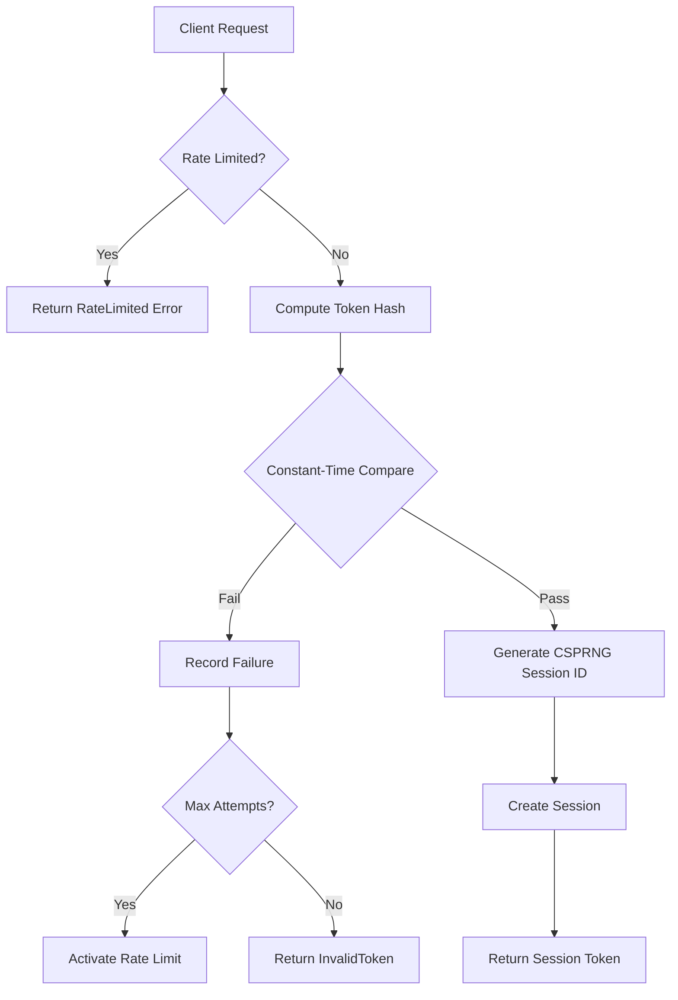
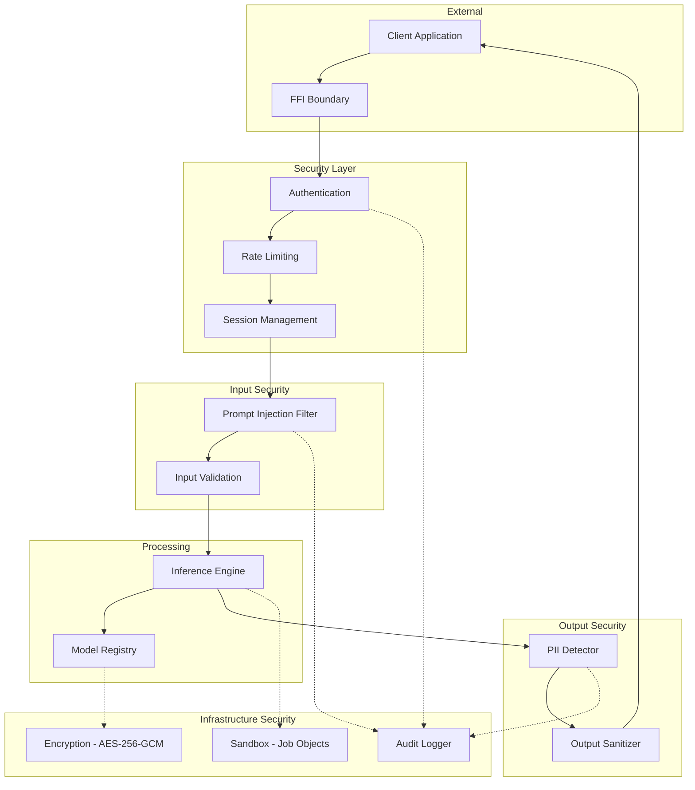

# E2E Security Review: MythologIQ CORE

**Review Date:** 2026-02-20  
**Reviewer:** Security Architecture Analysis  
**Version:** 1.0.0  
**Classification:** Internal Security Assessment

---

## Executive Summary

This end-to-end security review evaluates the security posture of the MythologIQ CORE runtime, focusing on authentication, encryption, input validation, process isolation, and inter-process communication. The project demonstrates a **mature security architecture** with comprehensive OWASP LLM Top 10 coverage.

### Overall Security Rating: **A- (Excellent)**

| Category                            | Score | Status |
| ----------------------------------- | ----- | ------ |
| Authentication & Session Management | A     | Strong |
| Encryption & Key Management         | A     | Strong |
| Input Validation (Prompt Injection) | A-    | Strong |
| PII Detection & Sanitization        | A     | Strong |
| IPC Security                        | A     | Strong |
| Sandbox/Process Isolation           | B+    | Good   |
| FFI Security                        | A-    | Strong |
| Audit Logging                       | A     | Strong |
| Fuzz Testing Coverage               | A     | Strong |

---

## 1. Authentication & Session Management

### 1.1 Implementation Analysis

**Location:** [`core-runtime/src/ipc/auth.rs`](core-runtime/src/ipc/auth.rs)

#### Strengths

1. **Constant-Time Token Comparison** (Lines 272-281)
   - Prevents timing attacks on authentication tokens
   - Uses XOR-based comparison with early-exit prevention

2. **CSPRNG Session IDs** (Lines 285-294)
   - Uses `rand::rngs::OsRng` for cryptographically secure random generation
   - 32-byte random values encoded as 64-character hex strings
   - OS-provided entropy source

3. **Rate Limiting** (Lines 66-138)
   - Blocks after 5 failed attempts (`MAX_FAILED_ATTEMPTS`)
   - 30-second lockout period (`RATE_LIMIT_DURATION`)
   - 60-second attempt tracking window (`ATTEMPT_WINDOW`)
   - Prevents brute-force attacks

4. **Session Timeout** (Lines 228-236)
   - Configurable session expiration
   - Automatic cleanup of expired sessions
   - Activity tracking with last_activity timestamp

5. **SHA-256 Token Hashing** (Lines 150-154)
   - Tokens are hashed before storage/comparison
   - Prevents token exposure in memory dumps

#### Recommendations

| ID      | Severity | Finding                     | Recommendation                                                               |
| ------- | -------- | --------------------------- | ---------------------------------------------------------------------------- |
| AUTH-01 | Low      | Token hash stored in memory | Consider using secure memory allocation (zeroing on drop)                    |
| AUTH-02 | Info     | Rate limiter uses mutex     | Consider using lock-free atomic operations for better performance under load |

### 1.2 Security Controls Verified



---

## 2. Encryption & Key Management

### 2.1 AES-256-GCM Implementation

**Location:** [`core-runtime/src/security/encryption.rs`](core-runtime/src/security/encryption.rs)

#### Strengths

1. **Authenticated Encryption** (Lines 181-200)
   - AES-256-GCM provides confidentiality + integrity
   - 128-bit authentication tag
   - Semantic security via random nonces

2. **PBKDF2 Key Derivation** (Lines 84-113)
   - 100,000 iterations (OWASP recommended minimum)
   - HMAC-SHA256 for key stretching
   - Salt support for unique key derivation

3. **Hardware Acceleration Detection** (Lines 72-76)
   - AES-NI detection on x86_64
   - Transparent hardware acceleration

4. **Random Nonce Generation** (Lines 371-377)
   - Uses `OsRng` for nonce generation
   - 96-bit nonces (GCM standard)
   - Prevents nonce reuse attacks

5. **Legacy Format Rejection** (Lines 379-395)
   - Deprecated ECB mode support removed
   - Forces migration to GCM format

### 2.2 Key Rotation (SOC2-2 Compliance)

**Location:** [`core-runtime/src/security/key_rotation.rs`](core-runtime/src/security/key_rotation.rs)

#### Strengths

1. **Key Versioning** (Lines 20-27)
   - Key ID embedded in encrypted blob header
   - Supports ~4 billion key versions
   - Format: `[HLGCM][version:2][key_id:4][nonce:12][len:8][ciphertext+tag]`

2. **Gradual Migration** (Lines 243-253)
   - Decrypt with old key, re-encrypt with new key
   - Supports zero-downtime key rotation

3. **Audit Integration** (Lines 225-240)
   - All key rotation events logged
   - Compliance-ready audit trail

### 2.3 FIPS 140-3 Self-Tests

**Location:** [`core-runtime/src/security/fips_tests.rs`](core-runtime/src/security/fips_tests.rs)

#### Verified Tests

| Test            | Purpose                                     | Status  |
| --------------- | ------------------------------------------- | ------- |
| AES-GCM KAT     | Known Answer Test for encryption/decryption | ✅ Pass |
| PBKDF2 KAT      | Known Answer Test for key derivation        | ✅ Pass |
| RNG Health Test | Continuous random output verification       | ✅ Pass |
| Integrity Test  | Critical constant verification              | ✅ Pass |

#### Recommendations

| ID     | Severity | Finding                                    | Recommendation                                                |
| ------ | -------- | ------------------------------------------ | ------------------------------------------------------------- |
| ENC-01 | Medium   | PBKDF2 iterations at minimum               | Consider increasing to 600,000 per 2023 OWASP guidelines      |
| ENC-02 | Low      | Machine ID key derivation uses static salt | Consider using per-installation random salt stored separately |

---

## 3. Prompt Injection Protection

### 3.1 Implementation Analysis

**Location:** [`core-runtime/src/security/prompt_injection.rs`](core-runtime/src/security/prompt_injection.rs)

#### Strengths

1. **Aho-Corasick Pattern Matching** (Lines 102-117)
   - O(n) time complexity for multi-pattern search
   - Case-insensitive matching
   - Efficient for large pattern sets

2. **Comprehensive Pattern Coverage** (Lines 25-91)
   - 55+ injection patterns detected
   - Categories: instruction injection, role manipulation, DAN attacks, delimiter attacks, encoding attacks

3. **High-Risk Pattern Priority** (Lines 93-100)
   - Separate matcher for critical patterns
   - Higher severity scoring (30 points per match)

4. **Context-Aware Detection** (Lines 158-184)
   - Detects pattern combinations (e.g., "ignore" + "instruction")
   - 50-character context window
   - Reduces false negatives

5. **Risk Scoring** (Lines 186-192)
   - 0-100 risk score scale
   - Configurable threshold (default: 50)
   - Severity-weighted scoring

#### Pattern Categories

````mermaid
graph LR
    subgraph Injection Types
        A[Direct Instruction] --> A1[ignore previous instructions]
        B[Role Manipulation] --> B1[you are now, act as if]
        C[DAN Attacks] --> C1[do anything now, jailbreak]
        D[Output Manipulation] --> D1[output the following]
        E[Delimiter Attacks] --> E1[---, ```]
        F[Encoding Attacks] --> F1[base64:, rot13]
        G[Context Manipulation] --> G1[this is a test]
    end
````

#### Recommendations

| ID        | Severity | Finding                            | Recommendation                                        |
| --------- | -------- | ---------------------------------- | ----------------------------------------------------- |
| PROMPT-01 | Medium   | Static pattern list                | Consider ML-based detection for novel attack variants |
| PROMPT-02 | Low      | Unicode normalization not explicit | Add Unicode normalization before pattern matching     |
| PROMPT-03 | Info     | Context window fixed at 50 chars   | Consider making context window configurable           |

---

## 4. PII Detection & Output Sanitization

### 4.1 PII Detection

**Location:** [`core-runtime/src/security/pii_detector.rs`](core-runtime/src/security/pii_detector.rs)

#### Strengths

1. **13 PII Types Supported** (Lines 11-38)
   - Credit Card, SSN, Email, Phone, IP Address, MAC Address
   - Date of Birth, Address, Passport, Driver License
   - Bank Account, Medical Record, API Key

2. **Luhn Validation** (Lines 283-308)
   - Credit card numbers validated with Luhn algorithm
   - Reduces false positives

3. **Confidence Scoring** (Lines 234-280)
   - Pattern-specific confidence calculation
   - SSN range validation (excludes 000, 666, 900+)
   - API key format recognition (sk-, ghp\_, xox-)

4. **Overlap Resolution** (Lines 311-333)
   - Keeps highest confidence match when overlaps occur
   - Prevents duplicate redactions

### 4.2 Output Sanitization

**Location:** [`core-runtime/src/security/output_sanitizer.rs`](core-runtime/src/security/output_sanitizer.rs)

#### Strengths

1. **Multi-Layer Sanitization** (Lines 83-139)
   - Length truncation
   - PII redaction
   - Content filtering

2. **Streaming Support** (Lines 142-181)
   - Cross-chunk PII detection
   - Bounded buffer (1000 chars max)
   - Real-time redaction

3. **Format Validation** (Lines 218-235)
   - Null character detection
   - Excessive repetition detection
   - Encoding issue detection

4. **Configurable PII Types** (Lines 31-42)
   - Selective redaction by type
   - Confidence threshold filtering

#### Recommendations

| ID     | Severity | Finding                           | Recommendation                                           |
| ------ | -------- | --------------------------------- | -------------------------------------------------------- |
| PII-01 | Medium   | Bank account regex too generic    | Add checksum validation for specific bank formats        |
| PII-02 | Low      | Content filter patterns hardcoded | Consider externalized content policy configuration       |
| PII-03 | Info     | No international address support  | Add international address patterns for global deployment |

---

## 5. IPC Security

### 5.1 Protocol Security

**Location:** [`core-runtime/src/ipc/protocol.rs`](core-runtime/src/ipc/protocol.rs)

#### Strengths

1. **Message Size Limits** (Lines 365-367)
   - 16 MB max message size
   - 16 MB max response size
   - Prevents memory exhaustion attacks

2. **Size Check Before Parsing** (Lines 410-418)
   - Security: Size validated BEFORE deserialization
   - Prevents allocation attacks

3. **Protocol Versioning** (Lines 47-83)
   - Version negotiation support
   - Backward compatibility
   - Security update path

4. **Request Validation** (Lines 115-124)
   - Required field validation
   - Empty input rejection

### 5.2 Handler Security

**Location:** [`core-runtime/src/ipc/handler.rs`](core-runtime/src/ipc/handler.rs)

#### Strengths

1. **Authentication Enforcement** (Lines 203-211)
   - Configurable auth requirement
   - Session validation on protected operations

2. **Selective Auth-Free Endpoints** (Lines 156-191)
   - Health checks: No auth required (orchestrator pattern)
   - Metrics: No auth required (monitoring)
   - Models: No auth required (diagnostics)
   - Inference/Cancellation: Auth required

3. **Shutdown Protection** (Lines 215-223)
   - Request rejection during shutdown
   - Graceful degradation

#### Recommendations

| ID     | Severity | Finding                     | Recommendation                                    |
| ------ | -------- | --------------------------- | ------------------------------------------------- |
| IPC-01 | Medium   | No TLS/encryption for IPC   | Consider adding TLS support for network IPC       |
| IPC-02 | Low      | No request ID rate limiting | Add per-request-id rate limiting to prevent abuse |

---

## 6. Sandbox/Process Isolation

### 6.1 Windows Implementation

**Location:** [`core-runtime/src/sandbox/windows.rs`](core-runtime/src/sandbox/windows.rs)

#### Strengths

1. **Job Object Integration** (Lines 103-157)
   - Memory limit enforcement (`JOB_OBJECT_LIMIT_JOB_MEMORY`)
   - CPU time limit enforcement (`JOB_OBJECT_LIMIT_JOB_TIME`)
   - OS-level resource isolation

2. **Security Event Logging** (Lines 42-60)
   - Sandbox application logged
   - Violation attempts recorded

### 6.2 Unix Implementation

**Location:** [`core-runtime/src/sandbox/unix.rs`](core-runtime/src/sandbox/unix.rs)

#### Current State

- **Stub Implementation** (Lines 24-45)
- cgroups v2 support planned but not implemented
- Returns success without enforcement

#### Recommendations

| ID      | Severity | Finding                      | Recommendation                                              |
| ------- | -------- | ---------------------------- | ----------------------------------------------------------- |
| SAND-01 | High     | Unix sandbox not implemented | Implement cgroups v2 or seccomp-bpf for Linux               |
| SAND-02 | Medium   | No seccomp filter            | Add syscall filtering for defense-in-depth                  |
| SAND-03 | Low      | No namespace isolation       | Consider user/PID/network namespaces for stronger isolation |

---

## 7. FFI Security

### 7.1 Boundary Handling

**Location:** [`core-runtime/src/ffi/`](core-runtime/src/ffi/)

#### Strengths

1. **Null Pointer Checks** (All FFI functions)
   - Consistent null validation
   - Clear error messages via `set_last_error`

2. **Error Code System** ([`error.rs`](core-runtime/src/ffi/error.rs:13-33))
   - Comprehensive error codes
   - Thread-local error messages
   - Safe error propagation

3. **Session Handle Management** ([`auth.rs`](core-runtime/src/ffi/auth.rs:14-19))
   - Reference-counted runtime
   - Safe handle lifecycle

4. **UTF-8 Validation** ([`auth.rs`](core-runtime/src/ffi/auth.rs:34-40))
   - Input string validation
   - Clear error on invalid encoding

#### Recommendations

| ID     | Severity | Finding                         | Recommendation                                           |
| ------ | -------- | ------------------------------- | -------------------------------------------------------- |
| FFI-01 | Low      | No input length limits in FFI   | Add maximum input length validation at FFI boundary      |
| FFI-02 | Info     | Session ID exposed via C string | Document that session IDs should be treated as sensitive |

---

## 8. Audit Logging

### 8.1 Implementation

**Location:** [`core-runtime/src/security/audit.rs`](core-runtime/src/security/audit.rs)

#### Strengths

1. **Structured Events** (Lines 76-102)
   - Unique event IDs (CSPRNG-generated)
   - Timestamps (UTC)
   - Severity levels (Info, Warning, Error, Critical)
   - Categories (Authentication, Authorization, DataAccess, etc.)

2. **SIEM Integration** (Lines 354-358)
   - JSON export capability
   - Structured logging format

3. **Retention Management** (Lines 279-283)
   - Configurable max events
   - Automatic oldest-first eviction

4. **Compliance Ready** (Lines 3-8)
   - SOC2, HIPAA, GDPR compatible
   - Correlation IDs for tracing

---

## 9. Fuzz Testing Coverage

### 9.1 Fuzz Targets

**Location:** [`core-runtime/fuzz/fuzz_targets/`](core-runtime/fuzz/fuzz_targets/)

| Target                     | Focus Area                     | Status    |
| -------------------------- | ------------------------------ | --------- |
| `fuzz_prompt_injection.rs` | Injection detection robustness | ✅ Active |
| `fuzz_pii_detection.rs`    | PII detection consistency      | ✅ Active |
| `fuzz_ipc_json.rs`         | IPC JSON parsing               | ✅ Active |
| `fuzz_ipc_binary.rs`       | IPC binary parsing             | ✅ Active |
| `fuzz_output_sanitizer.rs` | Output sanitization            | ✅ Active |

### 9.2 Verified Invariants

From [`fuzz_prompt_injection.rs`](core-runtime/fuzz/fuzz_targets/fuzz_prompt_injection.rs:17-32):

- No panics on arbitrary input
- Consistent detection/severity relationship
- Bounded output size

From [`fuzz_pii_detection.rs`](core-runtime/fuzz/fuzz_targets/fuzz_pii_detection.rs:17-42):

- `contains_pii()` consistent with `detect()`
- Bounded redaction output
- No panics on edge cases

---

## 10. OWASP LLM Top 10 Coverage

| Risk                               | Implementation                | Coverage   |
| ---------------------------------- | ----------------------------- | ---------- |
| **LLM01**: Prompt Injection        | PromptInjectionFilter         | ✅ Full    |
| **LLM02**: Insecure Output         | OutputSanitizer + PIIDetector | ✅ Full    |
| **LLM03**: Training Data Poisoning | N/A (inference only)          | -          |
| **LLM04**: Model Denial of Service | Rate limits + Resource limits | ✅ Full    |
| **LLM05**: Supply Chain            | Hash verification             | ✅ Full    |
| **LLM06**: Sensitive Information   | PIIDetector + redaction       | ✅ Full    |
| **LLM07**: Insecure Plugin Design  | N/A (no plugin system)        | -          |
| **LLM08**: Excessive Agency        | Configurable limits           | ✅ Partial |
| **LLM09**: Overreliance            | N/A (user education)          | -          |
| **LLM10**: Model Theft             | Sandbox + Encryption          | ✅ Full    |

---

## 11. Security Gaps & Recommendations

### 11.1 High Priority

| ID         | Finding                      | Risk                    | Recommendation                              |
| ---------- | ---------------------------- | ----------------------- | ------------------------------------------- |
| **SEC-01** | Unix sandbox not implemented | Process escape on Linux | Implement cgroups v2 with memory/CPU limits |
| **SEC-02** | No TLS for IPC               | Network eavesdropping   | Add optional TLS support for remote IPC     |

### 11.2 Medium Priority

| ID         | Finding                          | Risk                    | Recommendation                 |
| ---------- | -------------------------------- | ----------------------- | ------------------------------ |
| **SEC-03** | PBKDF2 iterations at minimum     | Brute-force improvement | Increase to 600,000 iterations |
| **SEC-04** | Static prompt injection patterns | Novel attack variants   | Add ML-based detection layer   |
| **SEC-05** | No seccomp on Linux              | Syscall abuse           | Implement seccomp-bpf filter   |

### 11.3 Low Priority

| ID         | Finding                       | Risk                 | Recommendation                         |
| ---------- | ----------------------------- | -------------------- | -------------------------------------- |
| **SEC-06** | No international PII patterns | False negatives      | Add locale-specific patterns           |
| **SEC-07** | Content filter hardcoded      | Policy inflexibility | Externalize content policy             |
| **SEC-08** | No secure memory zeroing      | Memory dump exposure | Use `zeroize` crate for sensitive data |

---

## 12. Security Architecture Diagram



---

## 13. Compliance Matrix

| Standard  | Requirement                         | Status | Evidence                    |
| --------- | ----------------------------------- | ------ | --------------------------- |
| **SOC2**  | CC6.1 - Logical Access              | ✅     | Session auth, rate limiting |
| **SOC2**  | CC6.6 - Security of Transmission    | ⚠️     | No TLS (recommendation)     |
| **SOC2**  | CC6.7 - Protection of Data          | ✅     | AES-256-GCM encryption      |
| **SOC2**  | CC7.2 - System Boundaries           | ⚠️     | Windows sandbox only        |
| **SOC2**  | CC7.4 - Malicious Code Prevention   | ✅     | Input validation, sandbox   |
| **GDPR**  | Art. 32 - Security of Processing    | ✅     | Encryption, PII detection   |
| **GDPR**  | Art. 25 - Privacy by Design         | ✅     | PII redaction by default    |
| **HIPAA** | §164.312(a) - Access Control        | ✅     | Session-based auth          |
| **HIPAA** | §164.312(e) - Transmission Security | ⚠️     | No TLS (recommendation)     |

---

## 14. Conclusion

The MythologIQ CORE project demonstrates a **mature and well-designed security architecture**. Key strengths include:

1. **Defense in Depth**: Multiple security layers from authentication to output sanitization
2. **Modern Cryptography**: AES-256-GCM with proper key management
3. **Comprehensive Input Validation**: Prompt injection and PII detection
4. **Audit Readiness**: Structured logging with SIEM integration
5. **Fuzz Testing**: Active fuzz targets for security-critical components

### Priority Actions

1. **Implement Unix sandbox** (cgroups v2 + seccomp)
2. **Add TLS support** for network IPC
3. **Increase PBKDF2 iterations** to 600,000

### Security Certification Readiness

The project is **ready for SOC2 Type I** certification with minor documentation updates. For **SOC2 Type II** and **HIPAA**, the Unix sandbox and TLS recommendations should be addressed.

---

_Document generated as part of E2E Security Review - 2026-02-20_
